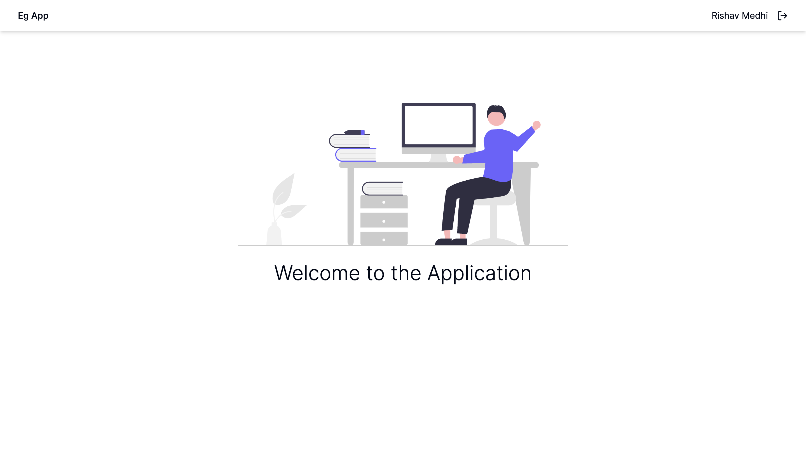
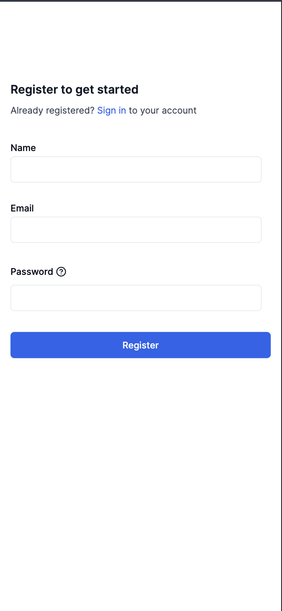
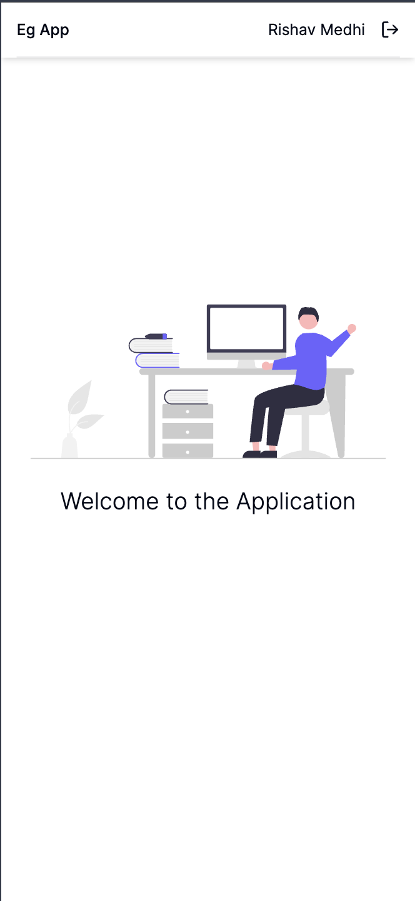

# EG App

Eg App is a user registration and login portal.

This is built using:

- NestJs (Server-side)
- MongoDb (Database)
- Vite + React + Typescript + TailwindCSS (Client-side)
- Authentication (JWT)

## Running in local

Node version used is `v20.10.0`

This project is split into two folders

- client - frontend code
- eg-app-server - server side code

Please make sure local mongodb instance is running in your system. Refer mongodb docs to learn how to install locally

### Running server-side

- Navigate to server side code base `cd eg-app-server`
- Install the dependencies using `npm install`
- Ensure mongodb local is running at `localhost:27017`
- Start the server by using `npm run start:dev`

### Running client-side

- Navigate to client code base `cd client`
- Install the dependencies using `npm install`
- Start the server using `npm run dev`
- Go to <http://localhost:5173/login> to access the login page

## App Specs

### Available Routes

- Login Page - <http://localhost:5173/login>
- Register Yourself Page - <http://localhost:5173/register>
- App Page - <http://localhost:5173/app> (accessible if you are signed-in
successfully from login page, otherwise redirected to login page for login)

### Screenshots

## Desktop View

Login Page

Signup Page

App Page

## Mobile View

Login Page

Signup Page

App Page

